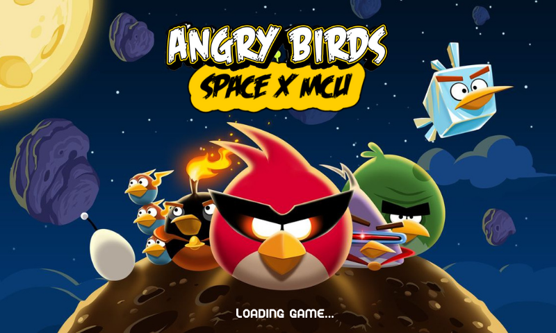

## Angry Birds: Space x MCU

---

## **Group: ByteMe**
1. Anouska Sahoo (Roll No. 2023096)
2. Vaishnavi Srivastava (Roll No. 2023574)

---

## Project Overview
We developed an immersive **Angry Birds : Space** game clone with a unique twist, featuring **Marvel Cinematic Universe (MCU)** designs and tasks.

Players use iconic powered up Angry Birds characters to defeat villains in creative levels, combining classic gameplay with superhero-themed goals of collecting the **Infinity Stones**. The game offers an engaging experience with **vibrant visuals and immersive soundtracks**, bringing the MCU to life in a fun, interactive way.

---

## Walkthrough

Click below to watch the walkthrough


<a href="https://youtu.be/cpYO8WvJYrk" target="_blank">
  
</a>

---

## **Implementation Details**

The game is developed using Java with a strong emphasis on **Object-Oriented Programming (OOP)** principles and incorporates several advanced techniques to create an engaging experience. The framework **libGDX** was utilized for handling textures, sprites, and rendering. Key game elements such as players, levels, obstacles, and characters are represented as classes to ensure modularity and scalability.

The gameplay features **slingshot-based projectile motion**, where players use Angry Birds with unique abilities to defeat villains (pigs). The six hardcoded levels, each representing an Infinity Stone, guide players toward the ultimate goal of collecting all stones to win.

**Serialization** is implemented to save player progress, ensuring continuity across sessions.
Our game comes with a preloaded trial player named 'byteme'. To access the preloaded game and explore the application features with this player, simply log in using the name 'byteme'

The design heavily utilizes **Object-Oriented Programming (OOP)** principles such as **inheritance**,  **polymorphism**, **abstraction**, **encapsulation**. This is evident for instance in Bird, Pig, Obstacle classes etc.

The project also follows **Factory Design Pattern**, which helps manage the creation of different game objects efficiently.

---
## **References:**
- The official **libGDX documentation** for understanding the game framework: [libGDX Documentation](https://libgdx.com/dev/).
- **Angry Birds official website** to familiarize ourselves with the game mechanics: [Angry Birds](https://www.angrybirds.com/).

---

## **Setup and Run Instructions:**

### **Prerequisites-**
1. Ensure **Java JDK 11+** is installed on your system.
2. Install an IDE such as **IntelliJ IDEA**
3. Download and set up **libGDX** for required libraries.

### **Steps to Set Up and Run-**

1. **Clone the Repository from GitHub:**
   ```bash
    git clone https://github.com/vaiiishhh/AngryBirds.git
    cd AngryBirds
   ```

2. **Import the Project in IntelliJ (or any other IDEs).**

3. **Set Up libGDX in Your Environment:**

4. **Run the Game:**
    - Run `Lwjgl3Launcher` located in `com/ByteMe/lwjgl3/Lwjgl3Launcher.java`.

5. **Running in Terminal (Optional):**
    - Navigate to the project directory:
      ```bash
      cd core/
      ./gradlew run
      ```

---

## **How to Navigate the Game**:

1. #### **Login Screen:**
    When you first launch the game, you will see the **Login Screen** where you can enter your unique player name. The game cannot proceed until a name has been entered.

2. #### **Home Screen:**
    After entering your name, you are taken to the **Home Screen**, which contains four buttons:
   - **New Game**: Leads to the level selection screen where you can start a new game.
   - **Load Saved Games**: Loads your previously saved game along with any progress you had made. If no game was saved it will display a message saying so and lead to the level selection page.
   - **Exit**: Ends the game while storing data from current session.
   - **About Us**: Displays information about the creators in the form of a leaderboard.

3. #### **Level Selection Screen:**
    Clicking on the **New Game** button from the home screen takes you to the **Level Selection Screen**, where you can choose between **Levels 1 through 6** with the game's difficulty increasing throughout.

4. #### **In-Game Options:**
    **Pause Game**: Each level has the following options which can be accessed through the Pause button which pauses the game and displays a screen with following buttons-
     1. **Resume Game**: Resumes game with the progress you had made before pausing.
     2. **Save Game**: Saves the progress you have made during the game so it can be loaded using **Load Game** button from the **Homescreen** in the current or a future session.
     3. **Exit Game**: Ends the level and directs you back to the **Homescreen**.
---

## **How to Run the JUnit Tests**:

1. Ensure you have **JUnit 5** and **Gradle** set up in your project.
2. Navigate to your project root directory.
3. Run the tests using the following Gradle command:

   ```bash
   ./gradlew test
   ```

4. View the test results in the terminal or the `build/reports/tests/test/index.html` file for a detailed report.

### Notes

- The tests use mock objects where applicable for dependencies.
- These tests are written with simplicity to ensure they cover core logic scenarios.
- checkOverlapTest: Validates the logic for detecting overlap between two rectangular areas using a custom isOverlapping method.
- CollisionTest: Simulates collisions between Bird and Pig objects to verify correct collision detection.
- TakeDamageTest: Tests the behavior of a simplified Pig class when it takes damage, including scenarios where the Pig is destroyed.

*We sincerely hope you enjoy playing the game just as much as we enjoyed creating it!*

(^oo^)

---
